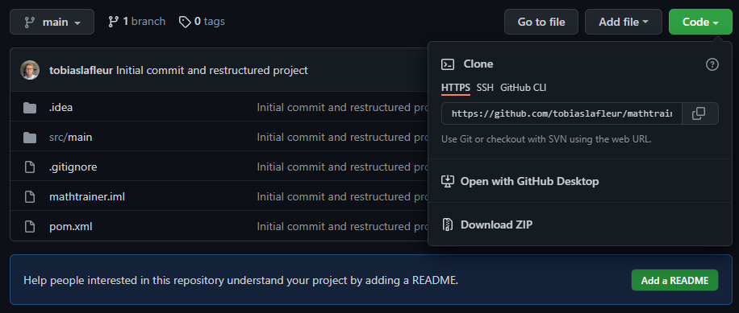
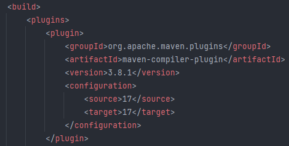

# mathtrainer

## How to run
1. Clone the repository  
     

2. Open the cloned repository with IntelliJ IDEA  

3. Go to File -> Project Structure -> Project, and set the project SDK to java version <b>17</b> (In the case you are using an older or newer version of java you need to change a configuration in the pom.xml file, change "source" and "target" to your version of java as shown in the image below, after updating the fields makes sure you refresh the maven as prompted in the text editor in IntelliJ IDEA)  
     

4. Create a new text file in mathtrainer folder, and name it .env    

5. Copy the lines in the file called envFile and paste it in the newly created .env file.   

6. Install .env plugins if needed by clicking on "install" on the upper right side of the .env file in IntelliJ   

7. Navigate into src/main/java/server and run Server.java to start the server.  

8. When the server is running navigate into src/main/java/client and run Main.java   